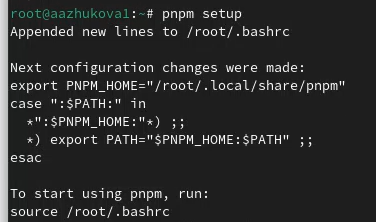

---
## Front matter
title: "Отчёт по лабораторной работе №4"
subtitle: "Продвинутое использование git."
author: "Жукова Арина Александровна"

## Generic otions
lang: ru-RU
toc-title: "Содержание"

## Bibliography
bibliography: bib/cite.bib
csl: pandoc/csl/gost-r-7-0-5-2008-numeric.csl

## Pdf output format
toc: true # Table of contents
toc-depth: 2
lof: true # List of figures
lot: true # List of tables
fontsize: 12pt
linestretch: 1.5
papersize: a4
documentclass: scrreprt
## I18n polyglossia
polyglossia-lang:
  name: russian
  options:
	- spelling=modern
	- babelshorthands=true
polyglossia-otherlangs:
  name: english
## I18n babel
babel-lang: russian
babel-otherlangs: english
## Fonts
mainfont: PT Serif
romanfont: PT Serif
sansfont: PT Sans
monofont: PT Mono
mainfontoptions: Ligatures=TeX
romanfontoptions: Ligatures=TeX
sansfontoptions: Ligatures=TeX,Scale=MatchLowercase
monofontoptions: Scale=MatchLowercase,Scale=0.9
## Biblatex
biblatex: true
biblio-style: "gost-numeric"
biblatexoptions:
  - parentracker=true
  - backend=biber
  - hyperref=auto
  - language=auto
  - autolang=other*
  - citestyle=gost-numeric
## Pandoc-crossref LaTeX customization
figureTitle: "Рис."
tableTitle: "Таблица"
listingTitle: "Листинг"
lofTitle: "Список иллюстраций"
lotTitle: "Список таблиц"
lolTitle: "Листинги"
## Misc options
indent: true
header-includes:
  - \usepackage{indentfirst}
  - \usepackage{float} # keep figures where there are in the text
  - \floatplacement{figure}{H} # keep figures where there are in the text
---

# Цель работы

Получение навыков правильной работы с репозиториями git.

# Задание

Выполнить работу для тестового репозитория.
Преобразовать рабочий репозиторий в репозиторий с git-flow и conventional commits.

# Выполнение лабораторной работы

## Установка программного обеспечения

1. Установка git-flow.

Необходимо установить git-flow при помощи команд: dnf copr enable elegos/gitflow и dnf install gitflow (рис. [-@fig:001]).

{#fig:001 width=70%}

2. Установка Node.js с помощью команд: dnf install nodejs и apt-get install pnpm (рис. [-@fig:002]-[-@fig:003]).

{#fig:002 width=70%}

{#fig:003 width=100%}

3. Настройка Node.js

Для дальнейшей работы нам необходимо запустить pnpm  при помощи команды pnpm setup (рис. [-@fig:004]).

{#fig:004 width=100%}

Выполняем команду: source ~/.bashrc (рис. [-@fig:005).

{#fig:005 width=70%}

4. Общепринятые коммиты

        4.1 commitizen

Для помощи в форматировании коммитов используем pnpm add -g commitizen (рис. [-@fig:006).

{#fig:006 width=70%}

        4.2 standard-changelog

Для помощи в создании логов используем pnpm add -g standard-changelog (рис. [-@fig:007]).

{#fig:007 width=70%}

5. Практический сценарий использования git

        5.1 Создание репозитория git

Создаём репозиторий на GitHub, называем его git-extended. (рис. [-@fig:008]).

{#fig:008 width=70%}

        5.2 Делаем первый коммит и выкладываем на github.

Используем команды: git commit -m "first commit", git remote add origin git@github.com:ArinaAlexZhukova/git-extended.git (рис. [-@fig:009]).

{#fig:009 width=70%}

git push -u origin master (рис. [-@fig:010]).

{#fig:010 width=100%}

        5.3 Конфигурация общепринятых коммитов

Настраиваем конфигурация для пакетов Node.js при помощи команды: pnpm init (рис. [-@fig:011]).

{#fig:011 width=100%}

Заполняем некоторорые параметры пакета. Сконфигурим формат коммитов, добавляя для в файл package.json команду для формирования коммитов (рис. [-@fig:012]).

{#fig:012 width=70%}

При помощи команды git add . добавляем новые файлы. Выполняем коммит при помощи команды git cz, а также выгружаем на github (рис. [-@fig:013]).

{#fig:013 width=70%}

            5.4 Конфигурация git-flow

Инициализируем git-flow при помощи команды git flow init (рис. [-@fig:043]).

{#fig:043 width=70%}

Устанавливаем префикс для ярлыков в v [-@fig:014]).

{#fig:014 width=70%}

Проверяем, что находимя на ветке branch (рис. [-@fig:015]).

{#fig:015 width=70%}

Загружаем весь репозиторий в хранилище при помощи git push --all (рис. [-@fig:016]).

{#fig:016 width=70%}

Устанавливаем внешнюю ветку как вышестоящую для этой ветки (рис. [-@fig:017]).

{#fig:017 width=100%}

Создание релиза с версией 1.0.0 при помощи git flow release start 1.0.0 (рис. [-@fig:018]).

{#fig:018 width=70%}

Создание журнала изменений с помощью команды standard-changelog --first-release (рис. [-@fig:019]).

{#fig:019 width=70%}

Добавление журнала изменений в индекс (рис. [-@fig:020]).

{#fig:020 width=70%}

Зальём релизную ветку в основную ветку (рис. [-@fig:021]).

{#fig:021 width=70%}

Отправка данных на github (рис. [-@fig:022]-[-@fig:023]).

{#fig:022 width=70%}

{#fig:023 width=70%}

Создание релиза на github (рис. [-@fig:024]).

{#fig:024 width=70%}

6. Работа с репозиторием git

        6.1 Разработка новой функциональности

Создание ветки для новой функциональности (рис. [-@fig:025]).

{#fig:025 width=70%}

Объединение ветки feature_branch c develop (рис. [-@fig:026]).

{#fig:026 width=70%}

        6.2 Создание релиза git-flow

Создаём релиз с версией 1.2.3 (рис. [-@fig:027]).

{#fig:027 width=70%}

Обновляем номер версии в файле package.json. Создаём журнал изменений (рис. [-@fig:028]).

{#fig:028 width=100%}

Добавим журнал изменений в индекс (рис. [-@fig:029]).

{#fig:029 width=70%}

Зальём релизную ветку в основную ветку (рис. [-@fig:030]).

{#fig:030 width=70%}

Отправка данных на github (рис. [-@fig:031]-[-@fig:032]).

{#fig:031 width=70%}

{#fig:032 width=70%}

Создание релиза на github с комментарием из журнала изменений (рис. [-@fig:033]).

{#fig:033 width=70%}

# Выводы

Нами были изучены и опробованы на практике многие возможности git-flow.

# Список литературы{.unnumbered}

::: {#refs}
:::
