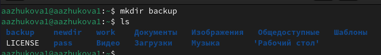
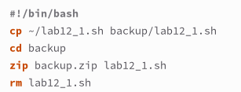
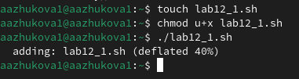
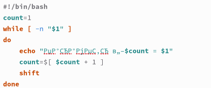
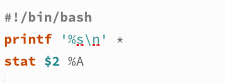

---
## Front matter
lang: ru-RU
title: Лабораторная работа № 12.
author: |
	Жукова Арина Александровна
institute: |
	RUDN, Москва, Россия
date: 2024, 27 апреля
## i18n babel
babel-lang: russian
babel-otherlangs: english

## Formatting pdf
toc: false
toc-title: Содержание
slide_level: 2
aspectratio: 169
section-titles: true
theme: metropolis
header-includes:
 - \metroset{progressbar=frametitle,sectionpage=progressbar,numbering=fraction}
 - '\makeatletter'
 - '\beamer@ignorenonframefalse'
 - '\makeatother'
  
## Fonts
mainfont: PT Serif
romanfont: PT Serif
sansfont: PT Sans
monofont: PT Mono
mainfontoptions: Ligatures=TeX
romanfontoptions: Ligatures=TeX
sansfontoptions: Ligatures=TeX,Scale=MatchLowercase
monofontoptions: Scale=MatchLowercase,Scale=0.9
---

# Информация

## Докладчик

:::::::::::::: {.columns align=center}
::: {.column width="70%"}

  * Жукова Арина Александровна
  * Студент факультета физико-математических и естественных наук
  * Учебная группа: НПИбд-03-23
  * Российский университет дружбы народов
  * [1132239120@rudn.ru](mailto:1132239129@rudn.ru)
  * <https://arinaalexzhukova.github.io/>

:::
::: {.column width="30%"}

:::
::::::::::::::

# Вводная часть

## Цели

Изучить основы программирования в оболочке ОС UNIX/Linux. Научиться писать небольшие командные файлы.

## Задачи

1. Написать скрипт, который при запуске будет делать резервную копию самого себя в другую директорию backup в вашем домашнем каталоге. При этом файл должен архивироваться одним из архиваторов на выбор zip, bzip2 или tar. 
2. Написать пример командного файла, обрабатывающего любое произвольное число
аргументов командной строки, в том числе превышающее десять.
3. Написать командный файл — аналог команды ls (без использования самой этой команды и команды dir), с выводом информации о самом каталоге и о возможностях доступа к файлам этого каталога.
4. Написать командный файл, который получает в качестве аргумента командной строки
формат файла и вычисляет количество таких файлов в указанной директории.

# Программирование в командном процессоре ОС UNIX. Командные файлы

## Создание нового каталога и файла для скрипта

{ #fig:001 width=100% }

## Первый скрипт

Откроем созданный файл lab12_1.sh в emacs и напишем скрипт, который при запуске будет архивировать сам себя в другую директорию backup в домашнем каталоге с помощью одного из выбранных архиваторов (zip, bzip2 или tar).

{ #fig:022 width=50% }

## Право на выполнение, запуск файла и проверка

{#fig:003 width=100%}

## Создание остальных файлов

По аналогии с первым файлом создаём файлы 2, 3 и 4. 

## Второй скрипт

Пример командного файла, обрабатывающего любое произвольное число аргументов командной строки, в том числе превышающее десять. Скрипт может последовательно распечатывать значения всех переданных аргументов.

{ #fig:005 width=50% }

## Третий скрипт

Напишем командный файл — аналог команды ls (без использования самой этой команды и команды dir). В котором требуется, чтобы он выдавал информацию о нужном каталоге и выводил информацию о возможностях доступа к файлам этого каталога.
	
{ #fig:008 width=50% }

## Четвёртый скрипт

Напишем командный файл, который получает в качестве аргумента командной строки формат файла (.txt, .doc, .jpg, .pdf и т.д.) и вычисляет количество таких файлов в указанной директории. Путь к директории также передаётся в виде аргумента командной строки. 

{ #fig:011 width=50% }

# Выводы

В ходе выполнения лабораторной работы мы изучили основы программирования в оболочке ОС UNIX/Linux и научились писать небольшие командные файлы.

## {.standout}

Спасибо за внимание!

