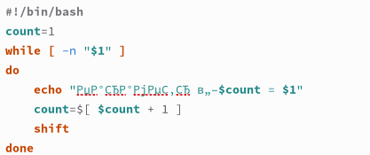

---
## Front matter
title: "Отчёт по лабораторной работе №12"
subtitle: "Программирование в командном процессоре ОС UNIX. Командные файлы"
author: "Жукова Арина Александровна"

## Generic otions
lang: ru-RU
toc-title: "Содержание"

## Bibliography
bibliography: bib/cite.bib
csl: pandoc/csl/gost-r-7-0-5-2008-numeric.csl

## Pdf output format
toc: true # Table of contents
toc-depth: 2
lof: true # List of figures
lot: true # List of tables
fontsize: 12pt
linestretch: 1.5
papersize: a4
documentclass: scrreprt
## I18n polyglossia
polyglossia-lang:
  name: russian
  options:
	- spelling=modern
	- babelshorthands=true
polyglossia-otherlangs:
  name: english
## I18n babel
babel-lang: russian
babel-otherlangs: english
## Fonts
mainfont: PT Serif
romanfont: PT Serif
sansfont: PT Sans
monofont: PT Mono
mainfontoptions: Ligatures=TeX
romanfontoptions: Ligatures=TeX
sansfontoptions: Ligatures=TeX,Scale=MatchLowercase
monofontoptions: Scale=MatchLowercase,Scale=0.9
## Biblatex
biblatex: true
biblio-style: "gost-numeric"
biblatexoptions:
  - parentracker=true
  - backend=biber
  - hyperref=auto
  - language=auto
  - autolang=other*
  - citestyle=gost-numeric
## Pandoc-crossref LaTeX customization
figureTitle: "Рис."
tableTitle: "Таблица"
listingTitle: "Листинг"
lofTitle: "Список иллюстраций"
lolTitle: "Листинги"
## Misc options
indent: true
header-includes:
  - \usepackage{indentfirst}
  - \usepackage{float} # keep figures where there are in the text
  - \floatplacement{figure}{H} # keep figures where there are in the text
---

# Цель работы

Изучить основы программирования в оболочке ОС UNIX/Linux. Научиться писать небольшие командные файлы.

# Задание

1. Написать скрипт, который при запуске будет делать резервную копию самого себя (то
есть файла, в котором содержится его исходный код) в другую директорию backup
в вашем домашнем каталоге. При этом файл должен архивироваться одним из архиваторов на выбор zip, bzip2 или tar. Способ использования команд архивации
необходимо узнать, изучив справку.
2. Написать пример командного файла, обрабатывающего любое произвольное число
аргументов командной строки, в том числе превышающее десять. Например, скрипт
может последовательно распечатывать значения всех переданных аргументов.
3. Написать командный файл — аналог команды ls (без использования самой этой команды и команды dir). Требуется, чтобы он выдавал информацию о нужном каталоге
и выводил информацию о возможностях доступа к файлам этого каталога.
4. Написать командный файл, который получает в качестве аргумента командной строки
формат файла (.txt, .doc, .jpg, .pdf и т.д.) и вычисляет количество таких файлов
в указанной директории. Путь к директории также передаётся в виде аргумента командной строки.

# Выполнение лабораторной работы

Откроем терминал и создадим в домашнем каталоге папку backup. После чего создадим файл lab12_1.sh для написания скрипта (рис. [-@fig:001]).

{ #fig:001 width=100% }

Откроем созданный файл lab12_1.sh в emacs и напишем скрипт, который при запуске будет архивировать сам себя в другую директорию backup в домашнем каталоге с помощью одного из выбранных архиваторов (zip, bzip2 или tar). (Рис. [-@fig:002])

{ #fig:002 width=100% }

После написания скрипта сохраним файл и закроем emacs. В терминале дадим файлу право на выполнение. Теперь запустим этот файл (рис. [-@fig:003]).

{#fig:003 width=100%}

Перейдём в каталог backup для проверки командой ls [-@fig:033]).

{ #fig:033 width=100% }

Создаём второй файл для скрипта lab12_2.sh и после внесения изменений дайм права (рис. [-@fig:004]).

{ #fig:004 width=100% }

Откроем файл lab12_2.sh и напишем пример командного файла, который обрабатывает любое произвольное число аргументов командной строки, даже превышающее десять. Этот скрипт может последовательно выводить значения всех переданных аргументов (рис. [-@fig:005]).

{ #fig:005 width=100% }

Запускаем файл lab12_2.sh (рис. [-@fig:006]).

{ #fig:006 width=100% }

Создаём третий файл (рис. [-@fig:007]). 

{ #fig:007 width=100% }

Откроем файл lab12_3.sh и напишем командный файл, который будет аналогом команды ls (но без использования самой этой команды и команды dir). Этот скрипт должен выводить информацию о заданном каталоге и предоставлять информацию о правах доступа к файлам в этом каталоге. (рис. [-@fig:008])
	
{ #fig:008 width=100% }

Сохраняем наш скрипт и даём право на выполнение. Запускаем файл для каталога backup (рис. [-@fig:009]). 

{ #fig:009 width=100% }

Создаём последний файл для четвёртого скрипта (рис. [-@fig:010]).

{ #fig:010 width=100% }

В последнем файле напишем командный файл, получающий в качестве аргумента формат файла (.txt, .doc, .jpg, .pdf и т. д.) и вычисляющий количество данных файлов в указанной директории. Путь к директории передаётся в виде аргумента командной строки. (Рис. [-@fig:011])

{ #fig:011 width=100% }

Даём файлу право на выполнение и запускаем его для двух форматов: .txt и .pdf (рис. [-@fig:012]).

{ #fig:012 width=100% }

# Контрольные вопросы

1. Объясните понятие командной оболочки. Приведите примеры командных оболочек. Чем они отличаются?

Командный процессор - программа, позволяющая пользователю взаимодействовать с операционной системой компьютера. 
Примеры: 
1. Оболочка Борна (Bourneshellили sh) это стандартная командная оболочка UNIX/Linux, содержащая базовый, но при этом полный набор функций; 
2. С оболочка (или csh) это надстройка на оболочкой Борна, использующая Сподобный синтаксис команд с возможностью сохранения истории выполнения команд; 
3. Оболочка Корна (или ksh) напоминает оболочку С, но операторы управления программой совместимы с операторами оболочки Борна; 
4. BASH сокращение от BourneAgainShell (опять оболочка Борна), в основе своей совмещает свойства оболочек С и Корна (разработка компании FreeSoftwareFoundation).
Отличия:
• Синтаксис: Каждая оболочка имеет свой собственный синтаксис для команд и скриптов.
• Встроенные команды: Разные оболочки имеют различные наборы встроенных команд, которые можно использовать без необходимости вызова внешних программ.
• Возможности расширения: Оболочки могут быть расширены с помощью сценариев, функций и псевдонимов, что позволяет пользователям настраивать и автоматизировать определенные задачи.
• Функции обработки параметров: Возможность оболочки обрабатывать параметры командной строки, передаваемые в сценарии и функции.
• Функции управления заданиями: Возможность оболочки управлять фоновыми процессами, такими как приостановка, возобновление и завершение.
• Поддерживаемые операционные системы: Некоторые оболочки разработаны для конкретных операционных систем, в то время как другие поддерживают более широкий спектр систем.

2. Что такое POSIX?

POSIX (Portable Operating System Interface for Computer Environments) это набор стандартов описания интерфейсов взаимодействия операционной системы и прикладных программ.

3. Как определяются переменные и массивы в языке программирования bash?
В Bash переменные определяются без указания типа данных: имя_переменной=значение
Массивы в Bash определяются с помощью ключевого слова declare: declare -a имя_массива=(элемент1 элемент2 элемент3)
Или, если элементы массива уже известны: имя_массива=(элемент1 элемент2 элемент3)
Например: declare -a числа=(1 2 3 4 5)
Для доступа к элементам массива используется следующий синтаксис: имя_массива[индекс]
Чтобы добавить элементы в массив, используйте команду +=: имя_массива+=(новый_элемент)
Например: имя_массива+=(новый элемент)
Чтобы удалить элементы из массива, используйте команду unset: unset имя_массива[индекс]
Например: unset имя_массива[0]

4. Каково назначение операторов let и read?

Оболочка bash поддерживает встроенные арифметические функции. Команда let является показателем того, что последующие аргументы представляют собой выражение, подлежащее вычислению. Простейшее выражение это единичный терм (term), обычно целочисленный. Команда let берет два операнда и присваивает их переменной. Команда read позволяет читать значения переменных со стандартного ввода: «echo “Please enter Month and Day of Birth ?”» «read mon day trash». В переменные monи day будут считаны соответствующие значения, введённые с клавиатуры, а переменная trash нужна для того, чтобы отобрать всю избыточно введённую информацию и игнорировать её. 

5. Какие арифметические операции можно применять в языке программирования bash?

В языке программирования bash можно применять такие арифметические операции как сложение (+), вычитание (-), умножение (*), целочисленное деление (/) и целочисленный остаток от деления (%). 

6. Что означает операция (( ))?

В (( )) можно записывать условия оболочки bash, а также внутри двойных скобок можно вычислять арифметические выражения и возвращать результат. 

7. Какие стандартные имена переменных Вам известны?

Стандартные переменные: 

- PATH: значением данной переменной является список каталогов, в которых командный процессор осуществляет поиск программы или команды, указанной в командной строке, в том случае, если указанное имя программы или команды не содержит ни одного символа /. Если имя команды содержит хотя бы один символ /, то последовательность поиска, предписываемая значением переменной PATH, нарушается. В этом случае в зависимости от того, является имя команды абсолютным или относительным, поиск начинается соответственно от корневогоили текущего каталога.

- PS1 и PS2: эти переменные предназначены для отображения промптера командного процессора. PS1 это промптер командного процессора, по умолчанию его значение равно символу $ или #. Если какая-то интерактивная программа, запущенная командным процессором, требует ввода, то используется промптер PS2. Он по умолчанию имеет значение символа >.

- HOME: имя домашнего каталога пользователя. Если команда cdвводится без аргументов, то происходит переход в каталог,указанный в этой переменной.

- IFS:последовательность символов, являющихся разделителями в командной строке, например, пробел, табуляция и перевод строки (newline).

- MAIL:командный процессор каждый раз перед выводом на экран промптера проверяет содержимое файла, имя которого указано в этой переменной, и если содержимое этого файла изменилось с момента последнего ввода из него, то перед тем как вывести на терминал промптер, командный процессор выводит на терминал сообщение Youhavemail(у Вас есть почта).

- TERM: тип используемого терминала.

- LOGNAME: содержит регистрационное имя пользователя, которое устанавливается автоматически при входе в систему. 

8. Что такое метасимволы?

Такие символы, как ’ < > * ? | " &, являются метасимволами и имеют для командного процессора специальный смысл. 

9. Как экранировать метасимволы?

Снятие специального смысла с метасимвола называется экранированием мета символа. Экранирование может быть осуществлено с помощью предшествующего мета символу символа , который, в свою очередь, является мета символом. Для экранирования группы метасимволов нужно заключить её в одинарные кавычки. Строка, заключённая в двойные кавычки, экранирует все метасимволы, кроме $, ’ , , ". Например, –echo* выведет на экран символ , –echoab’|’cd выведет на экран строку ab|*cd. 

10. Как создавать и запускать командные файлы?

Последовательность команд может быть помещена в текстовый файл. Такой файл называется командным. Далее этот файл можно выполнить по команде: «bash командный_файл [аргументы]». Чтобы не вводить каждый раз последовательности символов bash, необходимо изменить код защиты этого командного файла, обеспечив доступ к этому файлу по выполнению. Это может быть сделано с помощью команды «chmod +x имя_файла». Теперь можно вызывать свой командный файл на выполнение, просто вводя его имя с терминала так, как будтоон является выполняемой программой. Командный процессор распознает, что в Вашем файле на самом деле хранится не выполняемая программа, а программа, написанная на языке программирования оболочки, и осуществить её интерпретацию. 

11. Как определяются функции в языке программирования bash?

Группу команд можно объединить в функцию. Для этого существует ключевое слово function, после которого следует имя функции и список команд, заключённых в фигурные скобки. Удалить функцию можно с помощью команды unsetcфлагом -f. 

12. Каким образом можно выяснить, является файл каталогом или обычным файлом?

Чтобы выяснить, является ли файл каталогом или обычным файлом, необходимо воспользоваться командами «test-f [путь до файла]» (для проверки, является ли обычным файлом) и «test -d[путь до файла]» (для проверки, является ли каталогом). 

13. Каково назначение команд set, typeset и unset?

set:
* Выводит список всех определенных параметров оболочки (переменных окружения).
* Может использоваться для присвоения значений параметрам
typeset:
* Более совершенная версия команды set.
* Позволяет указать тип параметра.
* Также может использоваться для присвоения значений параметрам, но синтаксис отличается.
unset:
* Удаляет указанный параметр оболочки.

14. Как передаются параметры в командные файлы?

При вызове командного файла на выполнение параметры ему могут быть переданы точно таким же образом, как и выполняемой программе. С точки зрения командного файла эти параметры являются позиционными. Символ $ является метасимволом командного процессора. Он используется, в частности, для ссылки на параметры, точнее, для получения их значений в командном файле. В командный файл можно передать до девяти параметров. При использовании где-либо в командном файле комбинации символов $i, где 0 < i< 10, вместо неё будет осуществлена подстановка значения параметра с порядковым номером i, т.е. аргумента командного файла с порядковым номером i. Использование комбинации символов $0 приводит к подстановке вместо неё имени данного командного файла. 

15. Назовите специальные переменные языка bash и их назначение.

Специальные переменные: 
- $* отображается вся командная строка или параметры оболочки; 
- $? код завершения последней выполненной команды; 
- $$ уникальный идентификатор процесса, в рамках которого выполняется командный процессор; 
- $! номер процесса, в рамках которого выполняется последняя вызванная на выполнение в командном режиме команда; 
- ${#} возвращает целое число количествослов, которые были результатом $; 
- ${#name} возвращает целое значение длины строки в переменной name; 
- ${name[n]} обращение к n му элементу массива; 
- ${name[*]}перечисляет все элементы массива, разделённые пробелом; 
- ${name[@]} то же самое, но позволяет учитывать символы пробелы в самих переменных; 
- ${name:-value} если значение переменной name не определено, то оно будет заменено на указанное value; 
- ${name:value} проверяется факт существования переменной; 
- ${name=value} если name не определено, то ему присваивается значение value; 
- ${name?value} останавливает выполнение, если имя переменной не определено, и выводит value как сообщение об ошибке; 
- ${name+value} это выражение работает противоположно ${name-value}. Если переменная определена, то подставляется value; 
- ${name#pattern} представляет значение переменной name с удалённым самым коротким левым образцом (pattern); 
- ${#name[*]} и ${#name[@]} эти выражения возвращают количество элементов в массиве name.

# Выводы

В ходе выполнения лабораторной работы мы изучили основы программирования в оболочке ОС UNIX/Linux и научились писать небольшие командные файлы.

