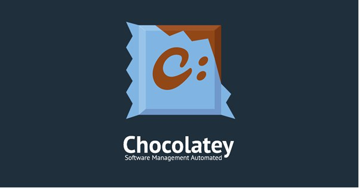

---
## Front matter
lang: ru-RU
title: Система управления пакетами Chocolatey
author: |
	Жукова Арина Александровна
institute: |
	RUDN, Москва, Россия
date: 2024, 15 мая
## i18n babel
babel-lang: russian
babel-otherlangs: english

## Formatting pdf
toc: false
toc-title: Содержание
slide_level: 2
aspectratio: 169
section-titles: true
theme: metropolis
header-includes:
 - \metroset{progressbar=frametitle,sectionpage=progressbar,numbering=fraction}
 - '\makeatletter'
 - '\beamer@ignorenonframefalse'
 - '\makeatother'
  
## Fonts
mainfont: PT Serif
romanfont: PT Serif
sansfont: PT Sans
monofont: PT Mono
mainfontoptions: Ligatures=TeX
romanfontoptions: Ligatures=TeX
sansfontoptions: Ligatures=TeX,Scale=MatchLowercase
monofontoptions: Scale=MatchLowercase,Scale=0.9
---

# Информация

## Докладчик

:::::::::::::: {.columns align=center}
::: {.column width="70%"}

  * Жукова Арина Александровна
  * Студент факультета физико-математических и естественных наук
  * Учебная группа: НПИбд-03-23
  * Российский университет дружбы народов
  * [1132239120@rudn.ru](mailto:1132239129@rudn.ru)
  * <https://arinaalexzhukova.github.io/>

:::
::: {.column width="30%"}

:::
::::::::::::::

# Вводная часть

## Цели

Исследовать систему управления пакетами Chocolatey как решение для автоматизации и упрощения управления программным обеспечением в системах Windows.

## Проблема

Управление программным обеспечением в системах Windows может быть сложной и трудоемкой задачей, особенно в больших и распределенных средах. Традиционные методы установки и обновления программного обеспечения вручную подвержены ошибкам и требуют значительных затрат времени и ресурсов.

## Гипотеза

Chocolatey может существенно улучшить процесс управления программным обеспечением в средах Windows, снижая риски, повышая эффективность и экономя время и ресурсы.

## Введение

Система управления пакетами Chocolatey предоставляет эффективный и удобный механизм управления программным обеспечением в операционной системе Windows, повышая эффективность и удобство при установке и обновлении программ.

Актуальность работы заключается в том, что система управления пакетами Chocolatey становится все более популярной среди пользователей Windows, как в домашнем, так и в корпоративном окружении. Понимание особенностей и возможностей Chocolatey, а также решение проблем, с которыми пользователи могут столкнуться при использовании этой системы, является важным для обеспечения эффективного управления программным обеспечением.

## История развития системы управления пакетами Chocolatey

Chocolatey - это инновационная система управления пакетами, предназначенная для операционной системы Windows. Рассмотрим историю развития этого инструмента, начиная с его создания.

## История развития системы управления пакетами Chocolatey

## История развития системы управления пакетами Chocolatey

Chocolatey, созданный в 2011 году, — инновационная система управления пакетами для Windows. Он упрощает установку и обновление программного обеспечения с помощью команд командной строки или графического интерфейса. Chocolatey экономит время, автоматизирует процессы и снижает вероятность ошибок. Он стал популярным инструментом для пользователей и ИТ-специалистов, облегчая управление программным обеспечением на компьютерах с Windows. Использование Chocolatey экономит время и снижает вероятность ошибок при установке программ.

## Преимущества использования Chocolatey перед другими системами управления пакетами

Chocolatey - менеджер пакетов для Windows, который упрощает установку, обновление и удаление программного обеспечения.

Chocolatey создает пакеты из установщиков, исполняемых файлов, zip-архивов и сценариев. Это упрощает управление программным обеспечением на Windows.

Chocolatey был создан в 2011 году и является хорошо зарекомендовавшим себя проектом. Он автоматизирует установку и обновление программ, позволяя пользователям легко управлять программным обеспечением на своих системах Windows.

## Основные команды Chocolatey для управления пакетами

• apikey: Управление ключами API для доступа к приватным пакетам.
• cache: Управление локальным кэшем HTTP для ускорения загрузки пакетов.
• config: Настройка параметров Chocolatey, таких как прокси и папки установки.
• download: Загрузка пакетов для локального использования.
• list: Отображение списка установленных пакетов.

Эти команды позволяют эффективно управлять пакетами программного обеспечения в Windows, автоматизируя установку, обновление и удаление.

## Интеграция Chocolatey с системами автоматизации и конфигурации

Chocolatey можно интегрировать с инструментами автоматизации, что позволяет управлять программным обеспечением и автоматизировать установку.

Интеграция Chocolatey с автоматизацией и системами конфигурации позволяет использовать Chocolatey с различными инструментами автоматизации инфраструктуры, такими как Jenkins. Это дает возможность использовать Chocolatey в автоматизированных процессах сборки, тестирования и развертывания.

Документация по Chocolatey на chocolatey.org содержит инструкции по его установке и настройке с различными инструментами автоматизации, такими как Jenkins. Это позволяет легко интегрировать Chocolatey в существующие процессы автоматизации и системы конфигурации.

## Проблемы и ограничения Chocolatey в процессе управления пакетами

• Ограничение GUI при отображении результатов поиска:

    * Не все пакеты отображаются.

    * Невозможность перейти на следующую страницу результатов.

• Проблема прав на распространение:

    * Общедоступный репозиторий менее надежен из-за ограничений на распространение.

    * Доступность и управление определенными пакетами могут быть ограничены.

• Раздел с проблемами и запросами на GitHub:

    * Пользователи могут сообщать о проблемах и запрашивать информацию.

    * Важный ресурс для понимания правил и устранения неполадок.

## Проблемы и ограничения Chocolatey в процессе управления пакетами

Таким образом, несмотря на множество преимуществ Chocolatey как системы управления пакетами, важно помнить о возможных проблемах и ограничениях, с которыми пользователи могут столкнуться. Открытость разработчиков к обратной связи и запросам пользователей позволяет улучшать систему и делать ее более удобной для использования.

## Сценарии использования Chocolatey в корпоративной среде

• Автоматизация установки программного обеспечения: Установка программного обеспечения на нескольких компьютерах без необходимости ручной установки.

• Управление обновлениями программного обеспечения: Планирование и автоматизация обновлений, чтобы обеспечить наличие последних версий программного обеспечения на всех компьютерах.

• Централизованное управление пакетами: Создание и управление пакетами программного обеспечения в централизованном репозитории для упрощения распространения и развертывания.

• Оптимизация развертывания программного обеспечения: Упрощение развертывания пакетов программного обеспечения на нескольких компьютерах через интерфейс командной строки и интеграцию с PowerShell.
 
## Безопасность при использовании Chocolatey для управления пакетами

Chocolatey — относительно безопасен при соблюдении рекомендаций: внутренние репозитории и пакеты без внешних ресурсов.

Меры безопасности включают запрос подтверждения пользователя перед выполнением действий, повышая общую безопасность.

Пользователи Reddit подтверждают безопасность и актуальность Chocolatey.

## Создание собственных пакетов для Chocolatey

Создание собственных пакетов для Chocolatey позволяет эффективно управлять программным обеспечением на Windows-компьютерах. Ознакомившись с документацией и используя шаблоны, пользователи могут разрабатывать пакеты для установки и обновления программ. Следуя рекомендациям, можно создавать пакеты, которые будут работать на различных системах. Собственные пакеты упрощают управление установкой программного обеспечения, особенно в корпоративных средах.

## Перспективы развития Chocolatey как системы управления пакетами

Chocolatey, система управления пакетами для Windows, позволяет автоматизировать установку, обновление и удаление программ. Запущенная в 2011 году, она объединяет различные типы установщиков в пакеты, которые можно устанавливать и обновлять через командную строку или графический интерфейс.

Сравнив Chocolatey с менеджерами пакетов в *nix, можно подчеркнуть его важность в управлении программами на Windows. Он облегчает администрирование, развертывая приложения на компьютерах под управлением Windows.

В корпоративной среде Chocolatey ценен благодаря управлению пакетами на нескольких компьютерах. Его функциональность и удобство делают его незаменимым для эффективного управления программным обеспечением на платформе Windows.
 
## Заключение

В заключение, Chocolatey — это мощная и гибкая система управления пакетами, которая революционизирует способ управления программным обеспечением в системах Windows. Она проста в использовании, безопасна и обладает широким набором функций, что делает ее ценным инструментом для администраторов, разработчиков и пользователей.

## Выводы

• Chocolatey значительно упрощает и автоматизирует управление программным обеспечением в системах Windows.

• Он обеспечивает централизованное управление установленными пакетами, снижая риски сбоев и ошибок конфигурации.

• Chocolatey экономит время и ресурсы, автоматизируя задачи установки и обновления.

• Интеграция с системами CI/CD позволяет автоматизировать развертывание программного обеспечения и поддержание его в актуальном состоянии.

# Ресурсы:

• Официальный веб-сайт Chocolatey: https://chocolatey.org/

• Документация Chocolatey: https://docs.chocolatey.org/

• Блог Chocolatey: https://blog.chocolatey.org/

• Сообщество Chocolatey: https://community.chocolatey.org/

## {.standout}

Спасибо за внимание!

