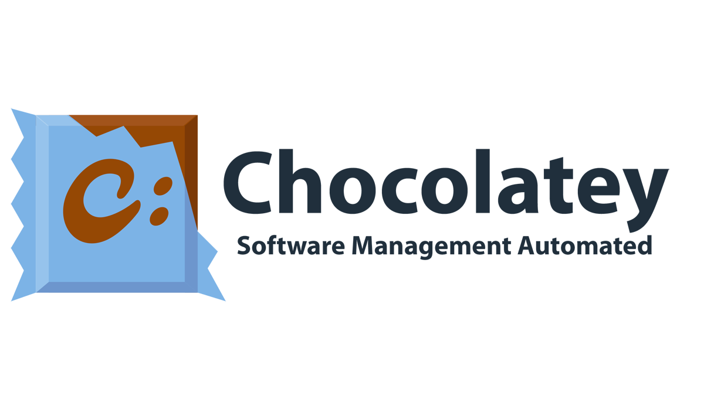

---
## Front matter
title: "Система управления пакетами Chocolatey"
author: "Жукова Арина Александровна"

## Generic otions
lang: ru-RU
toc-title: "Содержание"

## Bibliography
bibliography: bib/cite.bib
csl: pandoc/csl/gost-r-7-0-5-2008-numeric.csl

## Pdf output format
toc: true # Table of contents
toc-depth: 2
lof: true # List of figures
lot: true # List of tables
fontsize: 12pt
linestretch: 1.5
papersize: a4
documentclass: scrreprt
## I18n polyglossia
polyglossia-lang:
  name: russian
  options:
	- spelling=modern
	- babelshorthands=true
polyglossia-otherlangs:
  name: english
## I18n babel
babel-lang: russian
babel-otherlangs: english
## Fonts
mainfont: PT Serif
romanfont: PT Serif
sansfont: PT Sans
monofont: PT Mono
mainfontoptions: Ligatures=TeX
romanfontoptions: Ligatures=TeX
sansfontoptions: Ligatures=TeX,Scale=MatchLowercase
monofontoptions: Scale=MatchLowercase,Scale=0.9
## Biblatex
biblatex: true
biblio-style: "gost-numeric"
biblatexoptions:
  - parentracker=true
  - backend=biber
  - hyperref=auto
  - language=auto
  - autolang=other*
  - citestyle=gost-numeric
## Pandoc-crossref LaTeX customization
figureTitle: "Рис."
tableTitle: "Таблица"
listingTitle: "Листинг"
lofTitle: "Список иллюстраций"
lotTitle: "Список таблиц"
lolTitle: "Листинги"
## Misc options
indent: true
header-includes:
  - \usepackage{indentfirst}
  - \usepackage{float} # keep figures where there are in the text
  - \floatplacement{figure}{H} # keep figures where there are in the text
---

# Цели

Исследовать систему управления пакетами Chocolatey как решение для автоматизации и упрощения управления программным обеспечением в системах Windows.

# Проблема

Управление программным обеспечением в системах Windows может быть сложной и трудоемкой задачей, особенно в больших и распределенных средах. Традиционные методы установки и обновления программного обеспечения вручную подвержены ошибкам и требуют значительных затрат времени и ресурсов.

# Гипотеза

Chocolatey может существенно улучшить процесс управления программным обеспечением в средах Windows, снижая риски, повышая эффективность и экономя время и ресурсы.

# Введение

Система управления пакетами Chocolatey представляет собой инновационное решение в области автоматизации управления программным обеспечением для операционной системы Windows. С развитием информационных технологий и увеличением количества устанавливаемого программного обеспечения, возникает необходимость в эффективном и удобном инструменте для управления установкой и обновлением программ. Chocolatey обеспечивает удобный механизм управления пакетами, позволяя пользователям устанавливать и обновлять программы через командную строку или графический интерфейс.

Актуальность работы заключается в том, что система управления пакетами Chocolatey становится все более популярной среди пользователей Windows, как в домашнем, так и в корпоративном окружении. Понимание особенностей и возможностей Chocolatey, а также решение проблем, с которыми пользователи могут столкнуться при использовании этой системы, является важным для обеспечения эффективного управления программным обеспечением.

В данной работе будут рассмотрены следующие аспекты: история развития Chocolatey, преимущества использования Chocolatey перед другими системами управления пакетами, основные команды Chocolatey для управления пакетами, сравнение Chocolatey с другими популярными системами управления пакетами, интеграция Chocolatey с системами автоматизации и конфигурации, проблемы и ограничения Chocolatey, сценарии использования Chocolatey в корпоративной среде, вопросы безопасности при использовании Chocolatey, создание собственных пакетов для Chocolatey, а также перспективы развития Chocolatey как системы управления пакетами.

Исследование данных аспектов позволит получить полное представление о системе управления пакетами Chocolatey, ее возможностях, преимуществах и ограничениях, а также поможет пользователям эффективно использовать Chocolatey для управления программным обеспечением в различных сценариях.

# История развития системы управления пакетами Chocolatey

Chocolatey - это инновационная система управления пакетами, предназначенная для операционной системы Windows. Рассмотрим историю развития этого инструмента, начиная с его создания.

Chocolatey был разработан в 2011 году Робом Рейнольдсом. Он создал этот менеджер пакетов с целью предоставить пользователям Windows универсальное средство для установки и управления программным обеспечением на своих компьютерах. Chocolatey базируется на платформе NuGet и предлагает удобные команды командной строки для управления пакетами.

Основная идея Chocolatey заключается в том, чтобы облегчить процесс установки и обновления программ на Windows, делая его более автоматизированным и удобным. Chocolatey позволяет упаковывать установщики, исполняемые файлы, zip-архивы и сценарии в компилированные пакеты, что упрощает управление программами через командную строку или графический интерфейс.

Chocolatey стал популярным инструментом благодаря своей простоте использования и гибкости. Он позволяет пользователям устанавливать необходимые программы с минимальными усилиями, а также обновлять их с помощью нескольких простых команд. Благодаря возможности автоматизации установки программ на нескольких компьютерах, Chocolatey стал незаменимым инструментом для системных администраторов и разработчиков.

Используя Chocolatey, пользователи могут значительно упростить процесс управления программным обеспечением на Windows, сэкономив время и уменьшив вероятность ошибок при установке и обновлении приложений. Chocolatey продолжает развиваться и совершенствоваться, предлагая пользователям все новые возможности и улучшения в управлении пакетами на операционной системе Windows.

История развития Chocolatey является примером успешной инициативы по созданию удобного и эффективного инструмента для управления программным обеспечением на Windows. С каждым годом Chocolatey становится все более популярным среди пользователей и специалистов по информационным технологиям, облегчая им процесс установки и обновления программных продуктов на компьютерах под управлением Windows.

# Преимущества использования Chocolatey перед другими системами управления пакетами

Chocolatey - это менеджер пакетов для операционной системы Windows, который упрощает процесс установки, обновления и удаления программного обеспечения. 

Этот инструмент автоматизации компилирует установщики, zip-архивы, исполняемые файлы и сценарии в пакеты, что значительно облегчает управление программным обеспечением на Windows. Chocolatey был создан в 2011 году и является хорошо зарекомендовавшим себя и проверенным проектом. Он предлагает автоматизацию управления программным обеспечением, оборачивая установщики, исполняемые файлы, zip-архивы и сценарии в скомпилированные пакеты. Благодаря Chocolatey пользователи могут легко управлять установкой и обновлением программ на своих системах Windows.

# Основные команды Chocolatey для управления пакетами

Chocolatey - это мощный инструмент для управления пакетами программного обеспечения в операционной системе Windows. Для эффективного использования Chocolatey необходимо ознакомиться с основными командами, которые позволяют управлять установкой, обновлением и удалением пакетов. Рассмотрим некоторые из ключевых команд Chocolatey.

Одной из важных команд Chocolatey является "apikey". Эта команда позволяет получить, сохранить или удалить ключ API для определенного источника пакетов. Использование ключа API может быть необходимо для доступа к приватным пакетам или операциям, требующим аутентификации.

Другой полезной командой является "cache". С ее помощью можно управлять локальным кэшем HTTP, который используется для хранения запросов. Это особенно удобно для ускорения доступа к часто используемым пакетам и уменьшения времени загрузки.

Команда "config" предоставляет возможность настройки Chocolatey и его источников пакетов. Через эту команду можно задать различные параметры, такие как настройки прокси, папки для установки пакетов и другие опции, которые оптимизируют процесс управления пакетами.

Для загрузки пакетов Chocolatey для локального использования используется команда "download". Это позволяет сохранить пакеты на компьютере для последующей установки без необходимости повторной загрузки из интернета.
Кроме того, команда "list" является полезным инструментом для отображения всех установленных на компьютере пакетов Chocolatey. Это помогает легко отслеживать установленное программное обеспечение и его версии.

Изучение и понимание основных команд Chocolatey позволит эффективно управлять пакетами программного обеспечения на компьютере под управлением Windows. Команды Chocolatey предоставляют широкие возможности для автоматизации процесса установки, обновления и удаления программ, что делает работу с пакетным менеджером удобной и эффективной.

# Интеграция Chocolatey с системами автоматизации и конфигурации

Интеграция Chocolatey с автоматизацией и системами конфигурации предоставляет возможность использовать Chocolatey вместе с различными инструментами автоматизации инфраструктуры. С помощью этих инструментов можно взаимодействовать с Chocolatey, используя соответствующий интерфейс.

Chocolatey - это инструмент автоматизации управления программным обеспечением для Windows. Он позволяет упаковывать инсталляторы, исполняемые файлы, ZIP-архивы и скрипты в компилированные пакеты. Сайт chocolatey.org предоставляет дополнительную информацию о возможностях Chocolatey.

Помимо этого, документация содержит инструкции по установке и настройке сервера Jenkins. Jenkins является инструментом непрерывной интеграции / непрерывной доставки (часто называемым CI / CD), который обеспечивает необходимую автоматизацию.

Таким образом, Chocolatey предоставляет интеграцию с автоматизацией и системами конфигурации, позволяя управлять программным обеспечением и выполнять автоматическую установку с помощью различных инструментов.

# Проблемы и ограничения Chocolatey в процессе управления пакетами

Chocolatey - это мощный инструмент для управления пакетами в операционной системе Windows, однако у него также есть свои проблемы и ограничения, которые могут повлиять на опыт пользователей.

Одной из проблем, с которой могут столкнуться пользователи, является ограничение Chocolatey GUI, связанное с отображением результатов поиска. Не все доступные пакеты могут быть отображены, и возможно, что пользователи не смогут перейти на следующую страницу с результатами из-за зависимости Chocolatey GUI от сервера репозитория. Это может затруднить процесс поиска и установки нужных пакетов.

Еще одним значительным ограничением Chocolatey является вопрос прав на распространение. Согласно FAQ на официальном сайте, у Chocolatey есть серьезное ограничение в виде прав на распространение, что делает общедоступный репозиторий пакетов менее надежным по сравнению с внутренним репозиторием. Это может ограничить доступность определенных пакетов и усложнить процесс управления ими.

Кроме того, на платформе GitHub существует раздел с проблемами и запросами пользователей к разработчикам Chocolatey. Здесь пользователи могут высказывать свои проблемы, а также запрашивать информацию о правилах, реализованных в Chocolatey, что может быть важным для понимания работы системы. Обращение к этому разделу может помочь пользователям решить возникающие проблемы и получить необходимую информацию.

Таким образом, несмотря на множество преимуществ Chocolatey как системы управления пакетами, важно помнить о возможных проблемах и ограничениях, с которыми пользователи могут столкнуться. Открытость разработчиков к обратной связи и запросам пользователей позволяет улучшать систему и делать ее более удобной для использования.

# Сценарии использования Chocolatey в корпоративной среде

Chocolatey представляет собой инструмент автоматизации управления программным обеспечением для операционной системы Windows, который упаковывает установщики, исполняемые файлы, zip-архивы и сценарии в скомпилированные пакеты. Этот инструмент предлагает решение для корпоративных сред, предоставляя возможности автоматизации управления программным обеспечением.

Одним из основных сценариев использования Chocolatey в корпоративной среде является автоматизация установки программного обеспечения. Chocolatey позволяет предприятиям автоматизировать процесс установки программного обеспечения на нескольких компьютерах, что исключает необходимость в ручной установки и экономит время и усилия.

Управление обновлениями программного обеспечения также является важным сценарием использования Chocolatey в корпоративной среде. Предприятия могут легко управлять обновлениями программного обеспечения с помощью Chocolatey. Инструмент предоставляет механизмы планирования и автоматизации обновлений, гарантируя, что все компьютеры имеют последние версии установленного программного обеспечения.

Централизованное управление пакетами также является ключевым сценарием использования Chocolatey в корпоративной среде. Chocolatey предлагает централизованное управление пакетами, позволяя предприятиям создавать и управлять пакетами программного обеспечения в централизованном репозитории. Это упрощает процесс распространения и развертывания программного обеспечения по всей организации.

Оптимизация развертывания программного обеспечения также является важным сценарием использования Chocolatey в корпоративной среде. Chocolatey упрощает процесс развертывания программного обеспечения, предоставляя интерфейс командной строки и интеграцию с PowerShell. Это позволяет предприятиям оптимизировать развертывание пакетов программного обеспечения на нескольких компьютерах.

В целом, Chocolatey является мощным инструментом для автоматизации управления программным обеспечением в корпоративных средах. Он помогает повысить эффективность, сократить ручные усилия и обеспечить последовательное развертывание программного обеспечения по всей организации.
 
# Безопасность при использовании Chocolatey для управления пакетами

При обсуждении безопасности при использовании Chocolatey для управления пакетами, важно отметить, что согласно информации на официальной странице Chocolatey, система считается относительно безопасной, если следовать рекомендуемому пути. Это включает использование внутренних репозиториев с пакетами, которые зависят только от внутренних ресурсов. Дополнительные детали о мерах безопасности не предоставляются.

В обсуждениях на Reddit пользователи выражают мнение о потенциальной безопасности и актуальности Chocolatey по сравнению с аналогичными инструментами для Linux. Ответы пользователей свидетельствуют о том, что Chocolatey в целом считается безопасным и актуальным, что подтверждает его привлекательность для пользователей.

Документация Chocolatey также упоминает изменения, направленные на улучшение безопасности системы. В частности, отмечается, что теперь по умолчанию Chocolatey запрашивает подтверждение пользователя перед выполнением определенных действий, что способствует предотвращению нежелательных операций и повышению безопасности в целом.

Таким образом, можно сделать вывод, что при правильном использовании, включая работу с внутренними репозиториями и пакетами без использования внешних ресурсов, Chocolatey считается относительно безопасным инструментом. Обсуждения на Reddit также подтверждают безопасность и актуальность Chocolatey, а изменения в системе, направленные на повышение безопасности, демонстрируют внимание разработчиков к этому аспекту.
 
# Создание собственных пакетов для Chocolatey

Создание собственных пакетов для Chocolatey представляет собой важный аспект использования этой системы управления пакетами. Chocolatey предоставляет пользователям возможность создавать индивидуальные пакеты для установки и обновления программного обеспечения на компьютерах под управлением Windows. Для того чтобы создать собственный пакет, необходимо ознакомиться с процессом его разработки и использовать доступные инструменты и шаблоны.

На официальном сайте Chocolatey имеется подробная документация, содержащая информацию о том, как начать создавать собственные пакеты. Встроенные шаблоны упрощают процесс создания пакетов, позволяя быстро и эффективно генерировать необходимую структуру для упаковки программного обеспечения в пакеты Chocolatey. Эти шаблоны являются основой для создания пакетов и обеспечивают стандартизацию процесса.

При создании собственных пакетов для Chocolatey важно следовать рекомендациям и инструкциям, представленным в документации. Это поможет избежать ошибок и обеспечит корректную работу пакетов на различных системах. Разработчики Chocolatey предоставляют руководства по созданию индивидуальных пакетов, которые помогут пользователям освоить процесс создания и поддержки собственных пакетов.

Использование собственных пакетов в Chocolatey позволяет пользователям адаптировать установку и обновление программного обеспечения под свои потребности. Создание индивидуальных пакетов может быть особенно полезным в корпоративной среде, где необходимо управлять установкой программ на нескольких компьютерах одновременно. Пользователи могут создавать собственные пакеты для внутреннего использования и управлять ими с помощью Chocolatey, что повышает эффективность процесса управления программным обеспечением.

Таким образом, создание собственных пакетов для Chocolatey является важным инструментом для персонализации процесса управления программным обеспечением на компьютерах под управлением Windows. Благодаря встроенным шаблонам и подробной документации пользователи могут легко создавать индивидуальные пакеты и адаптировать их под свои потребности, что делает процесс установки и обновления программ более гибким и удобным.

# Перспективы развития Chocolatey как системы управления пакетами

Chocolatey - это система управления пакетами для операционной системы Windows, которая предоставляет удобные инструменты для автоматизации процесса установки, обновления и удаления программного обеспечения. Запущенный в 2011 году, Chocolatey продолжает активно развиваться и предлагать пользователям простой и эффективный способ управления программами и их зависимостями на Windows.

Одним из ключевых преимуществ Chocolatey является его способность объединять различные типы установщиков, исполняемых файлов, zip-архивов и скриптов в компилированные пакеты. Это позволяет пользователям устанавливать и обновлять программы как через командную строку, так и через графический интерфейс, делая процесс управления программным обеспечением более гибким и удобным.

Chocolatey сравнивают с менеджерами пакетов в *nix операционных системах, такими как yum, что подчеркивает его значимость и важность как инструмента для управления программами на Windows. Этот менеджер пакетов облегчает администрирование программного обеспечения и его зависимостей, позволяя быстро и легко развертывать необходимые приложения на компьютерах под управлением Windows.

Благодаря своей функциональности и удобству использования, Chocolatey находит широкое применение не только среди домашних пользователей, но и в корпоративной среде. Возможность управлять пакетами на нескольких компьютерах с помощью конфигурации и автоматизации делает Chocolatey привлекательным выбором для организаций, стремящихся к эффективному управлению программным обеспечением.

Таким образом, Chocolatey продолжает развиваться и улучшать свои возможности, предоставляя пользователям интуитивно понятный и мощный инструмент для управления программами на платформе Windows. Сочетание простоты использования, гибкости и широких функциональных возможностей делает Chocolatey незаменимым инструментом для тех, кто ценит эффективное управление программным обеспечением на своем компьютере или в организации.
 
# Заключение

В ходе исследования системы управления пакетами Chocolatey были рассмотрены различные аспекты, начиная с истории ее развития и заканчивая перспективами дальнейшего развития. Chocolatey представляет собой мощный инструмент, который значительно упрощает процесс управления программным обеспечением на операционной системе Windows.

Одним из ключевых моментов, выявленных в ходе исследования, является преимущество использования Chocolatey перед другими системами управления пакетами. Благодаря своей гибкости, простоте использования и широкому функционалу, Chocolatey позволяет эффективно управлять установкой и обновлением программ через командную строку или графический интерфейс.
Основные команды Chocolatey для управления пакетами были рассмотрены в работе, что позволяет пользователям быстро и удобно освоить основные функции этой системы. Сравнение Chocolatey с другими популярными системами управления пакетами позволяет выделить его преимущества и недостатки по сравнению с конкурентами.

Интеграция Chocolatey с системами автоматизации и конфигурации открывает новые возможности для оптимизации процессов управления программным обеспечением в корпоративной среде. Однако, были выявлены и проблемы, и ограничения Chocolatey, которые могут возникнуть в процессе использования этой системы.

Сценарии использования Chocolatey в корпоративной среде позволяют оценить практическую ценность этой системы для бизнеса. Безопасность при использовании Chocolatey для управления пакетами является одним из важных аспектов, который требует особого внимания и реализации соответствующих мер безопасности.

Создание собственных пакетов для Chocolatey открывает новые возможности для пользователей, позволяя адаптировать систему под свои потребности и требования. Наконец, перспективы развития Chocolatey как системы управления пакетами предвещают дальнейшее усовершенствование и расширение функционала, что делает эту систему еще более привлекательной для пользователей.

Таким образом, система управления пакетами Chocolatey представляет собой мощный инструмент, который обладает широкими возможностями и перспективами развития. Ее использование может значительно упростить процессы управления программным обеспечением и повысить эффективность работы как отдельных пользователей, так и корпоративных сетей.

# Список литературы{.unnumbered}

1. Chocolatey Software Docs | History [Электронный ресурс] -https://docs.chocolatey.org/docs/history   
2. Chocolatey [Электронный ресурс] - https://en.wikipedia.org/wiki/chocolatey   
3. About Chocolatey Software [Электронный ресурс] - https://chocolatey.org/about   
4. Chocolatey Software Docs | Why Chocolatey? [Электронный ресурс] -https://docs.chocolatey.org/docs/why   
5. What is Chocolatey? Windows Package Management [Электронный ресурс] - https://www.puppet.com/blog/what-is-chocolatey   
6. Chocolatey Software | Chocolatey - The package manager for ... [Электронный ресурс] -https://chocolatey.org/   
7. Chocolatey Software Docs | Commands [Электронный ресурс] - https://docs.chocolatey.org/en-us/choco/commands/   
8. Chocolatey Software Docs | List [Электронный ресурс] - https://docs.chocolatey.org/en-us/choco/commands/list   
9. 6 best package managers for Windows and beyond [Электронный ресурс] -https://blog.logrocket.com/6-best-package-managers-windows-beyond/   
10. Comparing Package Managers - Andrew Taylor [Электронный ресурс] - https://andrewstaylor.com/2023/11/06/comparing-package-managers/   
11. Chocolatey Software | Compare [Электронный ресурс] - https://chocolatey.org/compare   
12. Chocolatey Software Docs | Integrates with everything [Электронный ресурс] - https://docs.chocolatey.org/en-us/features/integrations   
13. Automate Package Internalizer (MSP/C4B) [Электронный ресурс] - https://docs.chocolatey.org/en-us/guides/organizations/automate-package-internalization   
14. Chocolatey Software Docs | Known Issues [Электронный ресурс] - https://docs.chocolatey.org/en-us/chocolatey-gui/known-issues   
15. Chocolatey Software Docs | FAQs [Электронный ресурс] - https://docs.chocolatey.org/en-us/faqs   
16. Issues · chocolatey/choco [Электронный ресурс] - https://github.com/chocolatey/choco/issues   
17. Use Cases [Электронный ресурс] - https://chocolatey.org/use-cases/   
18. Chocolatey for Business [Электронный ресурс] -https://chocolatey.org/products/chocolatey-for-business   
19. Chocolatey Software Docs | Security [Электронный ресурс] - https://chocolatey.org/security   
20. How safe and secure is Chocolatey, and how well ... [Электронный ресурс] - https://www.reddit.com/r/chocolatey/comments/leijhp/how_safe_and_secure_is_chocolatey_and_how_well/   
21. Create your own packages [Электронный ресурс] - https://docs.chocolatey.org/en-us/features/create-packages   
22. Chocolatey Software Docs | Create Packages [Электронный ресурс] -https://docs.chocolatey.org/en-us/create/create-packages   
23. Create Custom Package Templates [Электронный ресурс] - https://docs.chocolatey.org/en-us/guides/create/create-custom-package-templates   
24. Using Chocolatey Package Manager on Windows [Электронный ресурс] - https://docs.vultr.com/using-chocolatey-package-manager-on-windows   

::: {#refs}
:::
