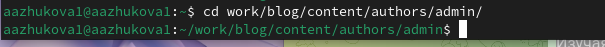
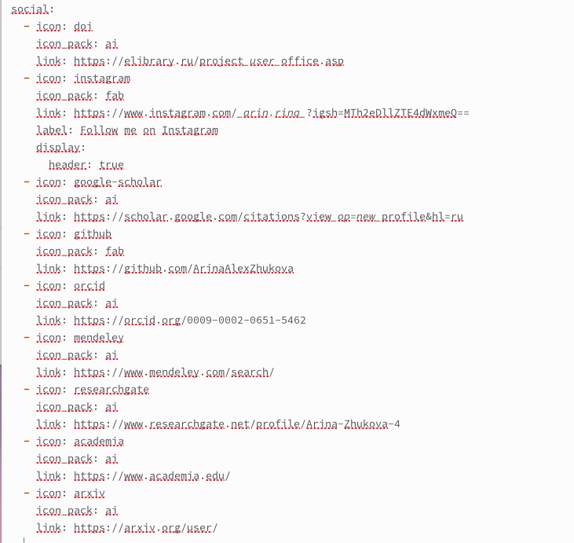
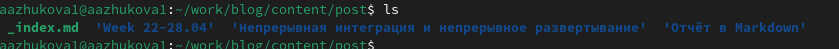
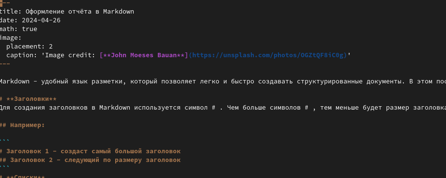
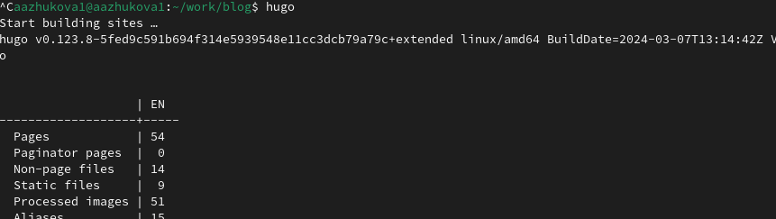
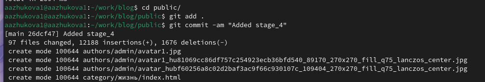
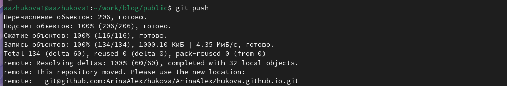
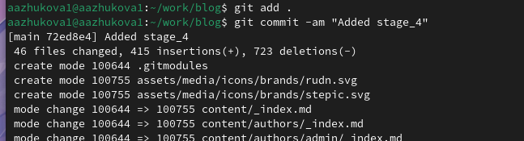
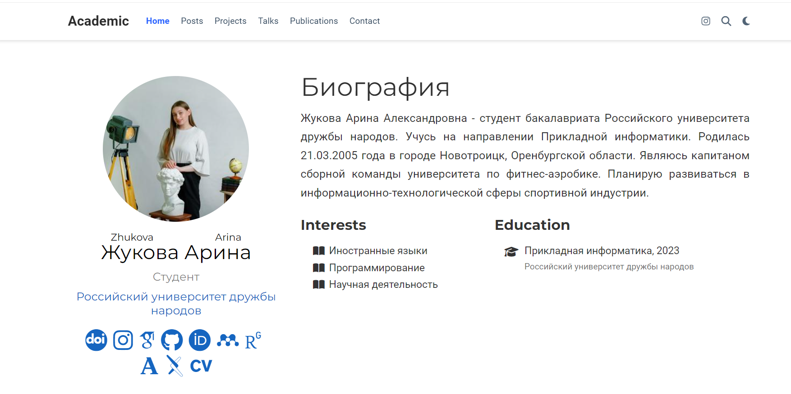
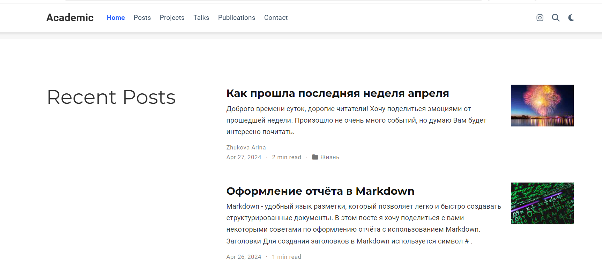

---
## Front matter
lang: ru-RU
title: Индивидуальный проект. Этап №4
author: |
	Жукова Арина Александровна
institute: |
	RUDN, Москва, Россия
date: 2024, 27 апреля
## i18n babel
babel-lang: russian
babel-otherlangs: english

## Formatting pdf
toc: false
toc-title: Содержание
slide_level: 2
aspectratio: 169
section-titles: true
theme: metropolis
header-includes:
 - \metroset{progressbar=frametitle,sectionpage=progressbar,numbering=fraction}
 - '\makeatletter'
 - '\beamer@ignorenonframefalse'
 - '\makeatother'
  
## Fonts
mainfont: PT Serif
romanfont: PT Serif
sansfont: PT Sans
monofont: PT Mono
mainfontoptions: Ligatures=TeX
romanfontoptions: Ligatures=TeX
sansfontoptions: Ligatures=TeX,Scale=MatchLowercase
monofontoptions: Scale=MatchLowercase,Scale=0.9
---

# Информация

## Докладчик

:::::::::::::: {.columns align=center}
::: {.column width="70%"}

  * Жукова Арина Александровна
  * Студент факультета физико-математических и естественных наук
  * Учебная группа: НПИбд-03-23
  * Российский университет дружбы народов
  * [1132239120@rudn.ru](mailto:1132239129@rudn.ru)
  * <https://arinaalexzhukova.github.io/>

:::
::: {.column width="30%"}

:::
::::::::::::::

# Вводная часть

## Цель 

Добавить к сайту ссылки на научные и библиометрические ресурсы.

# Задачи

1. Зарегистрироваться и разместить ссылку на сайтах eLibrary, Google Scholar, ORCID, Mendeley, github, Academia.edu, arXiv, ResearchGate.
2. Сделать пост по прошедшей неделе.
3. Добавить пост на тему: "Оформление отчета в Markdown".

# Выполнение четвёртого этапа индивидуального проекта

## Открытие файл для редактирования

{ #fig:001 width=100% }

## Добавление ссылок на ресурсы

{ #fig:002 width=60% }

## Создание постов

{ #fig:003 width=100% }

## Добавление информации для поста

{ #fig:004 width=80% }

## hugo

{ #fig:005 width=100% }

## Выгрузка из подкаталога "public"

{ #fig:006 width=100% }

{ #fig:066 width=100% }

## Выгрузка из каталога "blog"
	
{ #fig:007 width=100% }

## Внешний вид обновлённого сайта

{ #fig:008 width=80% }

## Внешний вид обновлённого сайта

!{ #fig:009 width=100% }

# Выводы

В ходе выполнения четвёртого этапа индивидуального проекта мы научились добавлять к сайту ссылки на научные и библиометрические ресурсы.

## {.standout}

Спасибо за внимание!

